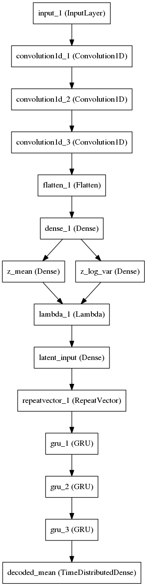
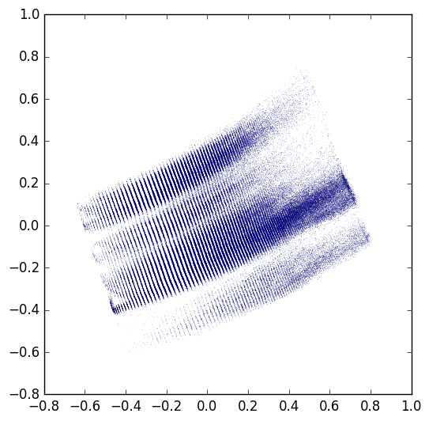

# A Keras implementation of Aspuru-Guzik's molecular autoencoder paper

<table style="border-collapse: collapse">
<tr>
<td style="vertical-align: top" valign="top">
    <strong>Abstract from the paper</strong>
    <p>We report a method to convert discrete representations of molecules to and from a multidimensional continuous representation. This generative model allows efficient search and optimization through open-ended spaces of chemical compounds.</p>
    <p>We train deep neural networks on hundreds of thousands of existing chemical structures to construct two coupled functions: an encoder and a decoder. The encoder converts the discrete representation of a molecule into a real-valued continuous vector, and the decoder converts these continuous vectors back to the discrete representation from this latent space.</p>
    <p>Continuous representations allow us to automatically generate novel chemical structures by performing simple operations in the latent space, such as decoding random vectors, perturbing known chemical structures, or interpolating between molecules. Continuous representations also allow the use of powerful gradient-based optimization to efficiently guide the search for optimized functional compounds. We demonstrate our method in the design of drug-like molecules as well as organic light-emitting diodes.</p>
    <p>
        <strong>Link to the paper</strong><br />
        <a href="https://arxiv.org/abs/1610.02415">arXiv</a>
    </p>
</td><td width="300">
</img>
</td>
</tr>
</table>

## Requirements

Install using `pip install -r requirements.txt` or build a docker container: `docker build .`

The docker container can also be built different TensorFlow binary, for example in order to use GPU:

`docker build --build-arg TF_BINARY_URL=https://storage.googleapis.com/tensorflow/linux/gpu/tensorflow-0.11.0rc1-cp27-none-linux_x86_64.whl .`

You'll need to ensure the proper CUDA libraries are installed for this version to work.

## Getting the datasets

A small 50k molecule dataset is included in `data/smiles_50k.h5` to make it easier to get started playing around with the model. A much larger 500k ChEMBL 21 extract is also included in `data/smiles_500k.h5`. A model trained on `smiles_500k.h5` is included in `data/model_500k.h5`.

All h5 files in this repo by [git-lfs](https://git-lfs.github.com/) rather than included directly in the repo.

To download original datasets to work with, you can use the `download_dataset.py` script:

* `python download_dataset.py --dataset zinc12`
* `python download_dataset.py --dataset chembl22`
* `python download_dataset.py --uri http://my-domain.com/my-file.csv --outfile data/my-file.csv`

## Preparing the data

To train the network you need a lot of SMILES strings. The `preprocess.py` script assumes you have an HDF5 file that contains a table structure, one column of which is named `structure` and contains one SMILES string no longer than 120 characters per row. The script then:

- Normalizes the length of each string to 120 by appending whitespace as needed.
- Builds a list of the unique characters used in the dataset. (The "charset")
- Substitutes each character in each SMILES string with the integer ID of its location in the charset.
- Converts each character position to a one-hot vector of len(charset).
- Saves this matrix to the specified output file.

Example:

`python preprocess.py data/smiles_50k.h5 data/processed.h5`

## Training the network

The preprocessed data can be fed into the `train.py` script:

`python train.py data/processed.h5 model.h5 --epochs 20`

If a model file already exists it will be opened and resumed. If it doesn't exist, it will be created.

By default, the latent space is 292-D per the paper, and is configurable with the `--latent_dim` flag. If you use a non-default latent dimensionality don't forget to use `--latent_dim` on the other scripts (eg `sample.py`) when you operate on that model checkpoint file or it will be confused.

## Sampling from a trained model

The `sample.py` script can be used to either run the full autoencoder (for testing) or either the encoder or decoder halves using the `--target` parameter. The data file must include a charset field.

Examples:

```
python sample.py data/processed.h5 model.h5 --target autoencoder

python sample.py data/processed.h5 model.h5 --target encoder --save_h5 encoded.h5

python sample.py target/encoded.h5 model.h5 --target decoder
```

## Performance

After 30 epochs on a 500,000 molecule extract from ChEMBL 21 (~7 hours on a NVIDIA GTX 1080), I'm seeing a loss of 0.26 and a reconstruction accuracy of 0.98.

Projecting the dataset onto 2D latent space gives a figure that looks pretty reasonably like Figure 3 from the paper, though there are some strange striations and it's not quite as well spread out as the examples in the paper.


